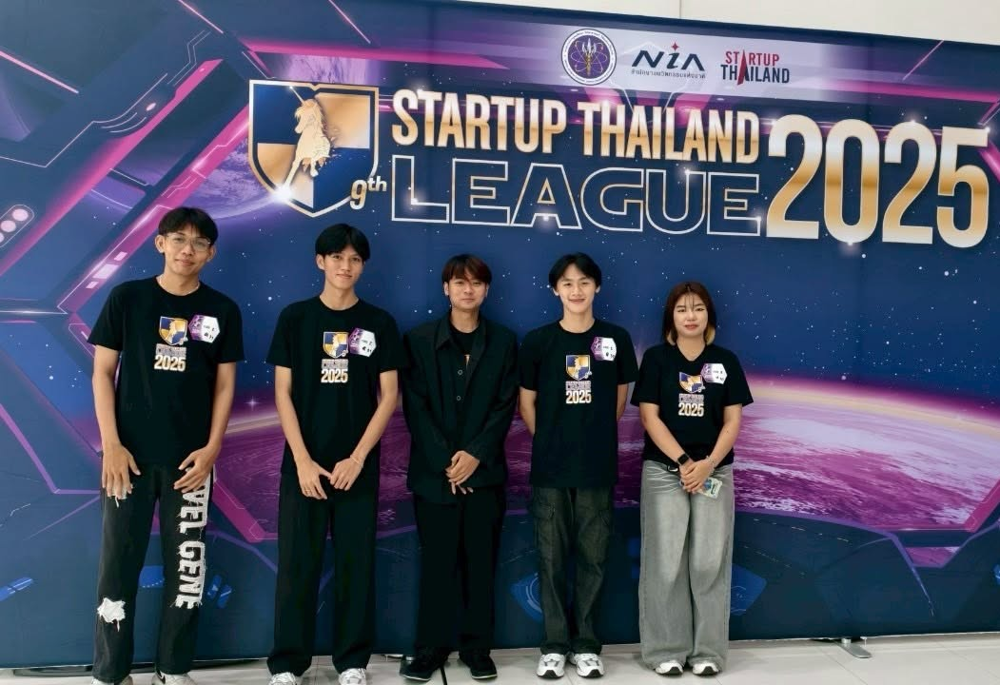
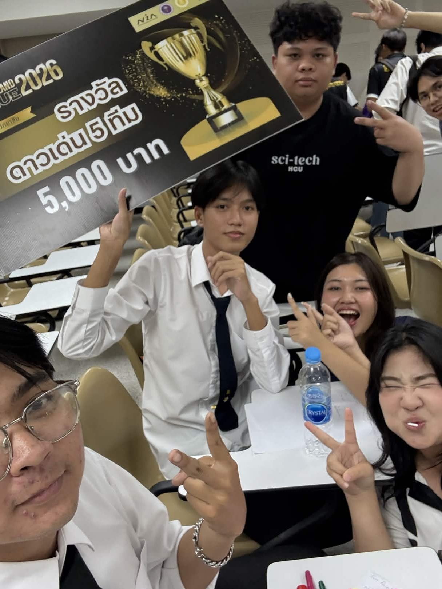

<h1 align="center">Hi  I'm Kittiphong Toadonthong</h1>
<h3 align="center">Computer Science Student | Aspiring Full-Stack Developer | IoT Enthusiast</h3>

    Huachiew Chalermprakiet University  
    Faculty of Science and Technology | Year 3

  

---

##  About Me

-  Passionate about building real-world web applications  
-  Interested in Full-Stack Development & IoT Integration  
-  Strong in system thinking & structured development  
-  Gamer mindset: Analyze → Optimize → Improve  

---

##  Featured Projects

###  FixMyCar
On-demand mechanic service web application  
- Role-based system (User / Mechanic / Admin)  
- Service workflow management  
- Mobile-first dashboard design  

---

###  CPR Learning & Simulation System
Interactive CPR training & simulation platform  
- Scenario-based logic  
- Dashboard & performance tracking  
- Educational system architecture  

---

###  LIFE CAL – Health Calculation System
Health metrics processing system  
- BMI & health indicator calculations  
- Backend logic design  
- Database integration  

---

###  Regional Tourism Website
Responsive tourism platform (Bootstrap-based)  
- Clean UI design  
- Structured content system  

---

##  Tech Stack

###  Frontend

  

###  Backend

  

###  IoT & Tools

  

- ESP32 Development  
- Embedded Systems  
- System Analysis  
- Database Design  

---

## 💪 My Activities

### Startup Thailand League 2025

  

### Startup Thailand League 2026

  

---

## 📊 GitHub Stats

  
  

---

##  Connect With Me

- GitHub: https://github.com/kittiphongkubkub  
- Email:  660856@hcu.ac.th

---

  <b>"Organized, systematic, and always troubleshooting until it works."</b>

