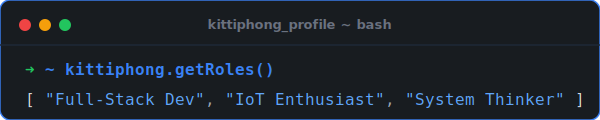

  

    
  
  
  
  

    

  

---

<h2 align="center"> About Me</h2>

Hi there! I am a **Year 3 Computer Science Student**  
at *Huachiew Chalermprakiet University*.   
I have a huge passion for **Software Architecture**  
and **Hardware Integration**. 

>  **Focus:** Building real-world web apps & bridging software with hardware.  
>  **Interests:** Full-Stack Web Development & IoT Integration.  
>  **Strengths:** System thinking & structured development.  
>  **Mindset:** Analyze &rarr; Optimize &rarr; Improve *(Gamer mindset)*.  

 

<h2 align="center"> Core Competencies & Tech Stack</h2>

###  IoT & Hardware 
 **ESP32 Development** &nbsp;&nbsp;|&nbsp;&nbsp;  **Embedded Systems**

###  Software Architecture
 **System Analysis** &nbsp;&nbsp;|&nbsp;&nbsp;  **Database Design** &nbsp;&nbsp;|&nbsp;&nbsp;  **MVC & Role-Based Auth**

 

**Programming Languages & Tools:**
  

 

<h2 align="center"> Featured Projects</h2>

|  Project Name |  Description & Details |  Focus Area |
| :---: | :--- | :---: |
| ** HELP ME CAR** | **On-demand mechanic service web application.** *Features:* Role-based system / Service workflow / Mobile-first UI |  `Full-Stack`  `Frontend` |
| ** CPR Simulation** | **Interactive CPR training & simulation platform.** *Features:* Scenario logic / Tracking Dashboard / Education Tech |  `IoT`   `Backend` |
| ** LIFE CAL** | **Health metrics processing system.** *Features:* BMI indicators / Backend logic / Database integration |  `Backend`  `Database` |
| ** Regional Tourism**| **Responsive regional tourism platform.** *Features:* Clean UI design / Bootstrap layout / Content management |  `Web UI`  `Frontend` |

 

---

<h2 align="center"> GitHub Activity & Metrics</h2>

  
  

 

  

 

  

  <i><b>"Organized, systematic, and always troubleshooting until it works."</b></i>

